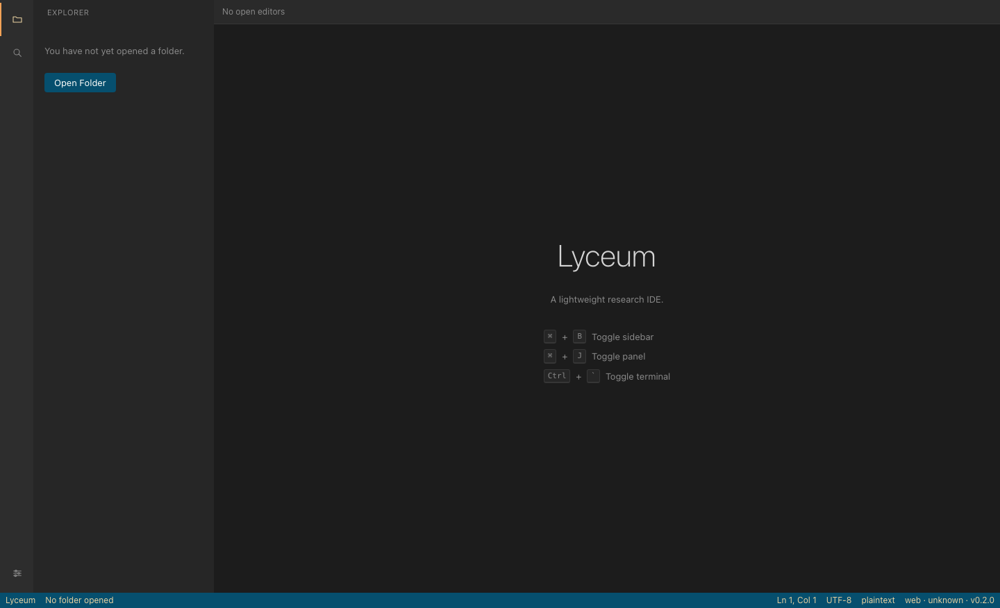

<p align="center">
  
</p>

<h1 align="center">Lyceum</h1>

<p align="center"><em>A lightweight, VS Code-inspired research IDE built with Tauri.</em></p>

A lightweight, VS Code-inspired **research IDE** built with Tauri. It pairs a focused, familiar editor layout (activity bar, sidebar, editor area, bottom panel, status bar) with a Monaco-based code editor, integrated terminal, built-in run profiles, syntax highlighting, Markdown/HTML/PDF/image preview, and a generic LSP client. Julia remains a first-class built-in language, but Lyceum is designed as a general research and development editor rather than a single-language tool. It is deliberately **not** a 1:1 VS Code clone — just a fast, focused editor for research work. All code is original and all dependencies are permissive open source; no VS Code source is copied.

## Screenshot

<p align="center">
  
</p>

## Tech stack

- **Backend:** Tauri v2, Rust (edition 2021).
- **Runtime:** the native OS WebView via Tauri — no Electron and no bundled Chromium, for a small binary and fast startup.
- **Frontend:** React 19 + TypeScript, built with Vite.
- **Editor:** Monaco Editor (lazy-loaded).
- **Terminal:** xterm.js in the frontend; a real PTY in the Rust backend via the `portable-pty` crate. Output is streamed over Tauri events; input is sent via Tauri commands.
- **Preview:** Markdown and sandboxed HTML inline previews, PDF.js (`pdfjs-dist`, lazy-loaded), plus raw-byte image previews for common browser image formats.
- **Syntax highlighting:** Monaco built-in grammars first, with small custom Monarch grammars where Monaco is missing or weak (Julia, LaTeX, TOML).
- **State management:** Zustand (small, simple stores). No Redux.
- **Styling:** plain CSS with CSS custom properties for theming. No heavy UI framework.
- **LSP:** a generic JSON-RPC LSP client. The Rust backend spawns language servers over stdio and bridges messages to the frontend via Tauri commands/events. Built-in server profiles cover Julia LanguageServer.jl, Python (`pyright`), TypeScript/JavaScript (`typescript-language-server`), Rust (`rust-analyzer`), C/C++ (`clangd`), Go (`gopls`), C# (`csharp-ls`), and R (`languageserver`).
- **Commands & keybindings:** a TypeScript command registry (every action is a command) plus a keybinding registry that maps shortcuts to command ids. Keybindings and settings are persisted as JSON in the OS app-config dir via Tauri.
- **Testing:** Vitest + React Testing Library (frontend), Node release-gate tests,
  and `cargo test` (Rust). CI also runs manifest-version consistency, npm audit,
  Rust clippy/fmt, cargo-audit, a production build, and the bundle-size gate.

## Local Install And Build

Lyceum is a Tauri desktop app. The source is intended to build on macOS,
Windows, and Linux, but each operating system produces its own native installer.
For reliable release artifacts, build on the target OS instead of trying to
cross-compile installers from another platform.

### 1. Install System Prerequisites

Install these on every platform:

- **Node.js 20.19+ below 21, or 22.12+** and npm — frontend toolchain and the local
  Tauri CLI. The repo pins Node `22.12.0` in `.nvmrc`.
- **Rust stable** with Cargo — Rust backend and native packaging.

Then install the OS-specific Tauri dependencies.

#### macOS

Install Xcode Command Line Tools:

```bash
xcode-select --install
```

Install Rust if needed:

```bash
curl --proto '=https' --tlsv1.2 https://sh.rustup.rs -sSf | sh
```

#### Windows

Install:

- Node.js 20.19+ below 21, or 22.12+
- Rust via `rustup`, using the **MSVC** toolchain
- Microsoft C++ Build Tools with **Desktop development with C++**
- Microsoft Edge WebView2 Runtime if it is not already installed
- VBSCRIPT optional feature if you build MSI installers and hit `light.exe`
  errors

In PowerShell, Rust can be installed with:

```powershell
winget install --id Rustlang.Rustup
rustup default stable-msvc
```

#### Linux

Install Node.js LTS and Rust, then install the Linux WebKit/build dependencies.
For Debian/Ubuntu:

```bash
sudo apt update
sudo apt install libwebkit2gtk-4.1-dev \
  build-essential \
  curl \
  wget \
  file \
  libxdo-dev \
  libssl-dev \
  libayatana-appindicator3-dev \
  librsvg2-dev
```

For Fedora:

```bash
sudo dnf check-update
sudo dnf install webkit2gtk4.1-devel \
  openssl-devel \
  curl \
  wget \
  file \
  libappindicator-gtk3-devel \
  librsvg2-devel \
  libxdo-devel
sudo dnf group install "c-development"
```

For Arch:

```bash
sudo pacman -Syu
sudo pacman -S --needed webkit2gtk-4.1 \
  base-devel \
  curl \
  wget \
  file \
  openssl \
  appmenu-gtk-module \
  libappindicator-gtk3 \
  librsvg \
  xdotool
```

See the official [Tauri v2 prerequisites](https://v2.tauri.app/start/prerequisites/)
if your distribution is not listed here.

### 2. Clone And Install Dependencies

```bash
git clone https://github.com/jake-w-liu/Lyceum.git lyceum
cd lyceum
npm ci
```

`npm ci` installs the locked frontend dependencies. Cargo downloads Rust crates
automatically on the first Rust/Tauri build.

### 3. Run In Development

```bash
npm run tauri dev
```

This launches the desktop app with the Vite dev server and hot reload.

### 4. Build A Local Installer

```bash
npm run tauri build
```

Build outputs are written under:

```text
src-tauri/target/release/bundle/
```

Expected local artifacts:

| Platform | Typical outputs |
| --- | --- |
| macOS | `bundle/macos/Lyceum.app`, `bundle/dmg/Lyceum_<version>_<arch>.dmg` |
| Windows | `bundle/msi/*.msi` and/or `bundle/nsis/*.exe` |
| Linux | `bundle/deb/*.deb`, `bundle/rpm/*.rpm`, and/or `bundle/appimage/*.AppImage` |

The exact formats depend on the host OS and installed packaging tools. The
current `src-tauri/tauri.conf.json` uses `"targets": "all"`, so Tauri attempts
all supported bundle formats for the current platform.

### 5. macOS Intel And Apple Silicon Builds

On Apple Silicon Macs, the default local DMG is usually `aarch64`. To also build
for Intel Macs, add the Rust target and pass it to Tauri:

```bash
rustup target add x86_64-apple-darwin
npm run tauri build -- --target x86_64-apple-darwin
```

To explicitly build Apple Silicon:

```bash
rustup target add aarch64-apple-darwin
npm run tauri build -- --target aarch64-apple-darwin
```

### 6. Public Distribution Notes

Local builds are useful for testing, but public installers should be signed.

- **macOS:** direct-download DMGs should be signed with a Developer ID
  certificate and notarized by Apple, otherwise Gatekeeper may block or warn.
- **Windows:** signing the installer reduces SmartScreen warnings, especially
  after the app has release history.
- **Linux:** signing depends on the package/channel you publish through.

For GitHub Releases, attach the platform installers as release assets. A user
can then download the installer for their OS from the release page.
The manual **Release Artifacts** GitHub workflow builds verification artifacts;
macOS bundles are ad-hoc signed (`signingIdentity: "-"`) but not Developer ID
signed or notarized, and production distribution still needs the platform
credentials above.

### Optional Runtime Tools

These are not required to build Lyceum itself:

- **Language runtimes** — required only for run profiles you use. Built-in run
  profiles cover Julia (`julia`), Python (`python3`, falling back to `python` or
  `py`), JavaScript (`node`), shell scripts (`sh` or `shellPath`), and R
  (`Rscript`). Set `runtimePaths.<language>` when a runtime is not on `PATH`.
- **Language servers** — required only for LSP features you use. Built-in LSP
  profiles cover Julia, Python, TypeScript/JavaScript, Rust, C/C++, Go, C#, and
  R. Lyceum degrades to plain editing when a server is not installed.
- **TeX engine** — required for LaTeX preview/build. Lyceum's Rust builder
  auto-selects an installed `latexmk`, `tectonic`, `pdflatex`, `xelatex`, or
  `lualatex` when the default build command is unchanged. Custom commands still
  require the configured tool to exist.

## Performance

Startup stays fast because the heavy editors are code-split into lazy chunks and
loaded only when first used — the verified **initial JS bundle is ~94 KiB
gzipped**, while
Monaco, PDF.js, image preview, xterm.js, and markdown-it live in separate chunks
fetched on demand. There is no Electron (the app uses the OS-native WebView via Tauri), no
extension marketplace, and no background indexing in v1. `src/perf.test.ts`
guards lazy loading, and `npm run check:bundle` enforces the initial
JavaScript/CSS gzip budgets against `dist/index.html`.

## Run tests

```bash
# Frontend (Vitest + React Testing Library)
npm test

# Manifest consistency + frontend typecheck/tests/build + bundle budget
npm run check

# Frontend dependency advisory gate
npm run audit

# Backend (Rust)
(cd src-tauri && cargo test)

# Backend formatting and lint gate
(cd src-tauri && cargo fmt --check && cargo clippy --all-targets -- -D warnings)
```

Per the no-bug policy, every feature ships with tests.

## Repository structure

```
Lyceum/
  docs/                ARCHITECTURE.md ROADMAP.md KEYBINDINGS.md SETTINGS_SCHEMA.md RISKS.md
  src/                 React + TS frontend
    main.tsx App.tsx
    components/        ActivityBar.tsx Sidebar.tsx EditorArea.tsx BottomPanel.tsx StatusBar.tsx ...
    state/             Zustand stores (layoutStore.ts, ...)
    commands/          command registry + built-in commands
    keybindings/       keybinding registry + default keymap JSON
    lib/               Tauri IPC wrappers, LSP client, etc.
    styles/            global.css, theme variables
  src-tauri/           Rust backend (Cargo.toml, tauri.conf.json, build.rs, src/main.rs, src/lib.rs, src/<modules>)
  public/
  index.html package.json tsconfig.json vite.config.ts
  TRACKER.md README.md
```

## Milestones

- **M0** Create Tauri + React + TypeScript project
- **M1** Shell layout: activity bar, sidebar, editor area, bottom panel, status bar
- **M2** File explorer + open-folder workflow
- **M3** Monaco editor with tabs + save/open
- **M4** Command registry + keybinding registry
- **M5** Embedded terminal (xterm.js + real shell process via PTY)
- **M6** PDF.js viewer
- **M7** Syntax highlighting + themes
- **M8** Built-in run-file and run-selection profiles
- **M9** Generic LSP client + built-in language-server profiles
- **M10** Settings persistence + workspace restore
- **M11** Markdown/LaTeX build-and-preview workflow
- **M12** Performance pass + packaging

## Documentation

- [docs/ARCHITECTURE.md](docs/ARCHITECTURE.md) — system design and module breakdown.
- [docs/ROADMAP.md](docs/ROADMAP.md) — milestones and delivery plan.
- [docs/KEYBINDINGS.md](docs/KEYBINDINGS.md) — default keymap and command bindings.
- [docs/SETTINGS_SCHEMA.md](docs/SETTINGS_SCHEMA.md) — persisted settings keys and schema.
- [docs/RISKS.md](docs/RISKS.md) — known risks and mitigations.
- [TRACKER.md](TRACKER.md) — task and progress tracker.

## Default keybindings

Use **Cmd** on macOS and **Ctrl** on Windows/Linux, except rows that explicitly
say **Ctrl**.

| Shortcut | Action |
| --- | --- |
| Cmd/Ctrl+P | Quick open |
| Cmd/Ctrl+Shift+P | Command palette |
| Cmd/Ctrl+B | Toggle sidebar |
| Ctrl+` | Toggle terminal panel |
| Ctrl+Shift+` | New terminal |
| Cmd/Ctrl+J | Toggle bottom panel |
| Cmd/Ctrl+S | Save |
| Cmd/Ctrl+Alt+S | Save all |
| Cmd/Ctrl+Shift+E | Reveal active file in Explorer |
| Cmd/Ctrl+W | Close tab |
| Cmd/Ctrl+Tab | Next tab |
| Cmd/Ctrl+Shift+Tab | Previous tab |
| Cmd/Ctrl+F | Find in file |
| Cmd/Ctrl+Shift+F | Search workspace |
| Cmd/Ctrl+G | Go to line |
| F12 / Cmd/Ctrl+Click | Go to definition |
| Shift+F12 | Find references |
| Cmd/Ctrl+/ | Toggle line comment |
| Alt/Option+Up/Down | Move line |
| Shift+Alt/Option+Up/Down | Duplicate line |
| Cmd/Ctrl+Enter | Run current file or selected code |
| Cmd/Ctrl+Shift+V | Preview Markdown/HTML/LaTeX |
| F2 | Rename selected file/folder (Explorer) |
| Esc | Close command palette / quick open / find box / modal panel / rename |

See [docs/KEYBINDINGS.md](docs/KEYBINDINGS.md) for the full reference.

## Run Profiles and LaTeX

- **Explorer selection and delete undo:** click a file or folder normally to
  select and open/toggle it. Cmd/Ctrl-click toggles individual rows, and
  Shift-click selects a contiguous visible range. **New File** / **New Folder**
  create inside the selected folder, beside a selected file, or at the workspace
  root when there is no single selected target. **Rename** by pressing **F2** on
  a selected item, by clicking the name of an already-selected file (a slow
  second click, as in VS Code), or via the inline rename button; **Esc** cancels.
  Drag selected files/folders onto another folder to move them. **Right-click**
  any file or folder for a context menu (New File/Folder, Rename, Delete, Copy
  Path / Copy Relative Path); rows show a file-type icon. Tabs have their own
  right-click menu (Close, Close Others, Close to the Right, Close Saved, Close
  All). **Delete Selected** moves items into a
  workspace-local `.lyceum-trash/` folder hidden from the Explorer; with the
  Explorer focused, Cmd/Ctrl+Z restores the last delete and Cmd/Ctrl+Shift+Z or
  Ctrl+Y redoes it.
- **Run code:** open a supported source file and click the tab-bar **Run**
  button, or press Cmd/Ctrl+Enter. If text is selected, only the selection runs;
  otherwise the whole file runs. Output appears in the bottom Output panel.
  Built-in profiles cover `.jl`, `.py`, `.js`/`.mjs`/`.cjs`,
  `.sh`/`.bash`/`.zsh`, and `.r` files. Runtime overrides live under
  `runtimePaths`.
- **Preview LaTeX:** open a `.tex` file and click the tab-bar **Preview** button
  (or run **Open Preview** from the command palette). Lyceum saves the current
  buffer, retargets `latexBuildCommand` to that file, runs it in the file's
  directory, and opens the produced PDF as a normal editor tab. With the stock
  command (`latexmk -pdf main.tex`), Lyceum's Rust builder checks for installed
  TeX tools and can use `latexmk`, `tectonic`, `pdflatex`, `xelatex`, or
  `lualatex`.
- **Compile LaTeX:** open a `.tex` file and click the tab-bar **Compile** button
  (or run **Compile LaTeX** from the command palette). This runs the same real
  PDF build, removes the previous same-name `.pdf` first, writes the fresh
  `.pdf` beside the `.tex` file, refreshes the Explorer, and leaves the active
  editor tab in source mode.

## Settings keys

Persisted as JSON in the OS app-config dir: `theme`, `fontFamily`, `fontSize`, `lineHeight`, `ligatures`, `tabSize`, `wordWrap`, `shellPath`, `terminalCwdBehavior` (`workspaceRoot` | `currentFileDir`), `runtimePaths`, `latexBuildCommand` (e.g. `latexmk -pdf main.tex`), `restoreWorkspaceOnStartup`, `minimap`, `lineNumbers`, `zoomLevel`.

Themes: `dark`, `light`, and `hc`. See [docs/SETTINGS_SCHEMA.md](docs/SETTINGS_SCHEMA.md) for the full schema.
